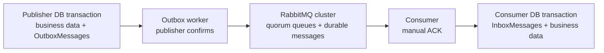

# RabbitMQ Exactly Once

Goal: implement effectively-once processing between:

- .NET publisher
- RabbitMQ cluster
- .NET consumer

Current branch: step 1 baseline with a default .NET publisher, default RabbitMQ, and default .NET consumer running in Docker.

## Run

```bash
docker compose -f infra/docker-compose.yml up --build
```

Send one random message:

```bash
curl -X POST http://localhost:8080/messages
```

RabbitMQ management UI:

- URL: http://localhost:15672
- User: `guest`
- Password: `guest`

RabbitMQ is an at-least-once message broker. It can redeliver messages, so true end-to-end exactly-once delivery must be handled by the applications.

This architecture targets exactly-once business effects.

## Steps

1. Start with default .NET publisher, RabbitMQ, and .NET consumer.
2. Add acknowledgements:
   - publisher confirms
   - manual consumer ACK after processing
3. Make RabbitMQ highly available:
   - cluster RabbitMQ nodes
   - use quorum queues
4. Make messages durable:
   - durable exchanges
   - durable queues
   - persistent messages
5. Add publisher transactional outbox:
   - save business data and outgoing message in one DB transaction
   - publish later from an outbox worker
   - mark published only after RabbitMQ confirms
6. Add idempotency:
   - DLQ for poison messages
   - globally unique `messageId`
   - consumer-side `InboxMessages` table

## Final Flow



## Why InboxMessages?

RabbitMQ may deliver the same message more than once. The consumer stores each processed `messageId` in `InboxMessages` using a unique key.

The consumer must save `InboxMessages` and business changes in the same DB transaction. Then it ACKs RabbitMQ only after commit.

This makes redelivery safe: duplicates are detected and skipped.

## Key Rule

Do not claim RabbitMQ gives exactly-once delivery. Claim exactly-once business processing over at-least-once delivery.
